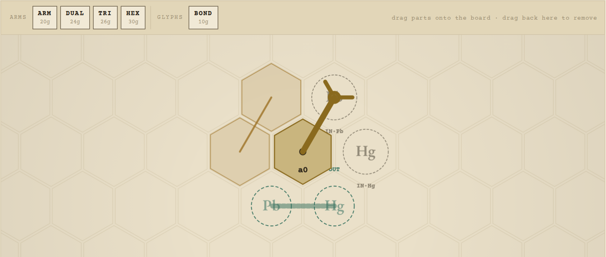
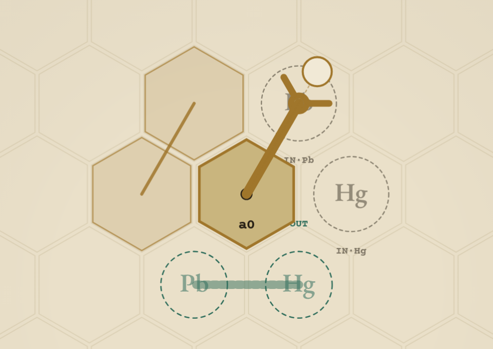
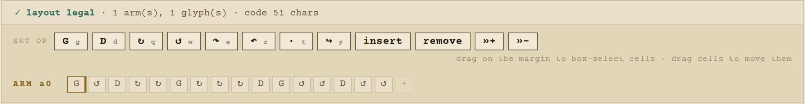
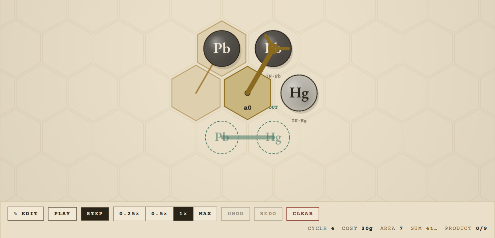
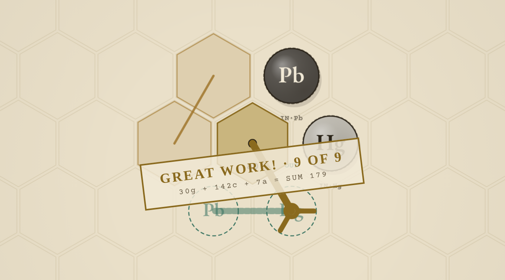

# How to play Great Work!

You build a little machine (arms plus floor markings on a hex grid) that turns a puzzle's ingredients into its product, nine times. The verifier scores it, and when you submit, the Thru program on alphanet runs it again and records the result on the public leaderboard.

## Your first 5 minutes

1. **Open https://greatwork.quest.** The tabs are the seven puzzles, easiest on the left. Pick **Lead Amalgam**: bond a lead (Pb) to a quicksilver (Hg) and lay the pair on the product.
2. **Read the board.** `IN·Pb` and `IN·Hg` spawn a fresh atom whenever their cell is empty. `OUT` shows the molecule it wants as a ghost. The card in the top-left lists the steps for this puzzle.
   
3. **Place parts.** Drag **ARM** (20g) and **BOND** (10g) from the tray onto the board. Click a part to select it, then drag its round handle to aim it, or use `[` and `]` to rotate it. Selecting a glyph shows a card explaining what it does.
   
4. **Program the arm.** Click the arm to open its tape. Click a tape cell, then press a key: `g` grab, `d` release, `q`/`w` turn, `e`/`r` pivot, `t` wait. Each instruction takes one cycle, and the tape loops forever.
   
5. **Run it.** Press **▶ Test**. **Pause** and **Step** let you watch one cycle at a time. If two atoms collide or a molecule gets pulled two ways, a red *Rejected* stamp names the fault and the tick. Press **✎ Edit** to go back and fix it.
   
6. **Read the score.** After nine products, the stamp reads **GREAT WORK!** with the score, for example `30g + 142c + 7a = SUM 179`. If you're stuck, this link opens that exact machine: https://greatwork.quest/#amalgam.AgEAAAAFABBYJEgKtmwBAAEABQIAAgEAAQIAAAEAAgA
   
7. **Seal it.** Press **Create passkey** once. This makes a browser passkey and a Thru wallet that the passkey owns. Then press **Submit**, name the solution and yourself, and approve the passkey prompt. Alphanet fees are zero.
8. **Find your row.** The **On-chain record** panel below the editor ranks every sealed solution for the puzzle. Yours is marked `· you`. Press **Refresh** if it hasn't appeared yet.
9. **Watch a replay.** On any row, **load** opens the machine in the editor (then press **▶ Test**), and **gif** plays it as an animation. Every solution's full machine is stored on-chain.

## The pieces

- **ARM / DUAL / TRI / HEX** (20/24/26/30g): an arm with 1, 2, 3 or 6 grippers that reaches 1 to 3 cells.
- **Elbow** (+10g): drop an arm on another arm's shaft to mount it there. Mounting it at the tip replaces the grabber and refunds 5g.
- **BOND** (10g) joins two atoms. **DEBOND** (15g) separates them.
- **CALCIFY** (10g): turns air, earth, fire or water into salt.
- **DUPE** (20g): turns a salt into a copy of a neighboring air, earth, fire or water atom.
- **PROJECT** (20g): uses up a quicksilver to move a metal one rung up the ladder, lead → … → gold.
- **PURIFY** (20g): turns two of the same metal into one of the next rung.
- **ANIMA** (20g): turns two salts into one vitae and one mors.
- **DISPOSE** (0g): destroys a loose atom.
- **Reagents and product**: free. You can move and rotate them, but not remove them.

## Scoring

**COST** is the gold spent on parts. **CYCLES** is the cycle on which the ninth product lands. **AREA** counts every cell that an atom, arm base or gripper touched, plus every glyph cell. **SUM = COST + CYCLES + AREA**, and lower is better. The leaderboard ranks by SUM only, and ties go to whoever submitted first, so copying the leader changes nothing.

## Three tips

1. **Cut cycles first.** You need nine products, so cycles are usually the biggest number (142 of the 179 above). A DUAL costs 4g more than an ARM, and it can grab the next atom while it delivers the current one.
2. **Stay compact.** Area counts every cell anything ever sweeps through. Put glyphs right next to the reagents, use short arms, and avoid wide swings.
3. **Study the leaders.** **load** the top machine and **Step** through it. Give arms that work together tapes of the same length (**insert** / **remove**), and use **»+** to delay an arm's start without changing its loop.

## Prize escrow

Anyone can open a pot on a puzzle, and anyone can add to it. The next machine whose SUM is strictly lower than the current best takes the crown and relights the fuse (30 days by default). When the fuse burns out, the contract pays the whole pot to the champion. Rules: `SPEC.md` §13 on the `claude/igg-29-deploy-prep` branch. In this editor build, *winnings* is just your passkey wallet's balance, and **Claim to Thru wallet** moves it to your Thru wallet.

## Troubleshooting

- **Submit is greyed out.** Hover over it to see why. Either the run hasn't reached GREAT WORK! yet, or you need a passkey ("create or use a passkey to submit").
- **No passkey prompt.** Passkeys need https and a browser with WebAuthn support. Use greatwork.quest, not a local `http://` copy.
- **New browser or device:** press **Use my passkey**, not **Create passkey**. If you get "that passkey has no wallet here yet", create one.
- **"waiting for your passkey…"**: approve the prompt (Touch ID, Windows Hello, security key). Dismissing it ends in "not submitted".
- **"not submitted: …" (the transaction reverted).** The program runs your machine again and reverts anything that doesn't verify, so nothing invalid lands on-chain. The revert codes are:
  - `0x200+`: the machine faulted.
  - `0x100+`: the board layout is invalid.
  - `0x01`: bad instruction data.
  - `0x02`: unknown puzzle.
  - `0x05`: no signer.

  The editor only lets you submit a run that already passed locally, so the usual cause is a stale cached editor. Hard-refresh the page, run ▶ Test again, and resubmit.
